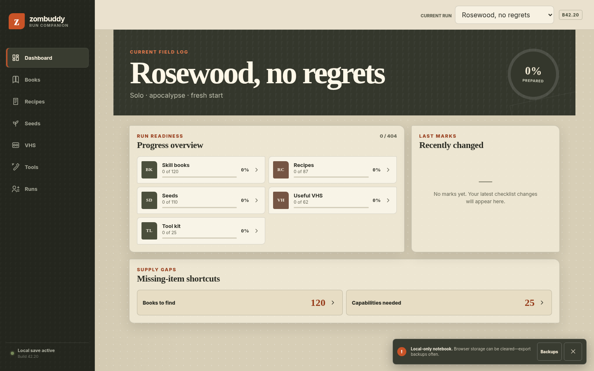

<div align="center">
  
  <h1>zombuddy</h1>
  <p><strong>An offline field notebook for solo Project Zomboid runs.</strong></p>
  <p>
    <a href="https://github.com/igorbachurin/zombuddy/actions/workflows/ci.yml"></a>
    
    
  </p>
</div>



zombuddy is a mobile-first, installable checklist for tracking the books, recipes, seeds, useful VHS tapes, and tools collected during a vanilla Project Zomboid run. It works offline after the first visit and keeps every run entirely in the browser—there are no accounts, analytics, ads, or cloud saves.

The bundled English catalog targets **Project Zomboid Build 42.20.0**.

## What it tracks

| Checklist | Included |
| --- | ---: |
| Skill books | 120 books across 24 complete five-volume skill families |
| Recipe literature | 87 magazines, manuals, catalogs, and schematics |
| Seed packets | 110 full and empty packets that teach growing seasons |
| Progression VHS | 62 tapes: 48 Retail VHS and 14 rare Home VHS |
| Tool capabilities | 25 capability groups with qualifying vanilla variants |

Each run has isolated progress and can be renamed, archived, restored, or permanently deleted. Media follows `Missing → Owned → Read/Watched`; tools store quantity, base location, and a field note.

Other features include:

- Dashboard summaries, recent changes, search, status filters, and grouped checklists
- PZwiki search links without copying wiki descriptions or artwork
- Validated JSON backup and atomic restore
- Installable PWA shell with precached catalog and offline operation
- User-controlled update prompts—an open checklist is never silently reloaded
- Keyboard navigation, screen-reader labels, reduced-motion support, and 44 px touch targets

## Privacy and data safety

Run data is stored in IndexedDB on the current browser profile. Nothing is sent to a server, but clearing browser/site data can erase the notebook. Export backups regularly from the **Runs** page.

A backup is validated in full before any database write. Replacing existing data requires confirmation and occurs in a single IndexedDB transaction.

## Development

Requirements:

- Node.js 22 (also declared in `.nvmrc` and `package.json`)
- npm
- Chromium for the Playwright suite

```bash
npm ci
npm run dev
```

Useful commands:

```bash
npm run lint
npm run typecheck
npm test
npm run validate:catalog
npm run build
npm run test:e2e
```

`npm run check` runs linting, type checking, unit/component tests, catalog validation, and the production build. GitHub Actions also installs Chromium and runs the mobile and desktop Playwright scenarios.

## Catalog generation

Installed game files are authoritative. Maintainers can use a Project Zomboid installation or obtain the free Dedicated Server files through anonymous SteamCMD using App `380870`.

```bash
npm run generate:catalog -- \
  --media /path/to/ProjectZomboid/media \
  --build 42.20.0 \
  --previous src/data/catalogs/42.20.0.json
```

The generator independently reads:

- `scripts/generated/items/**/*.txt`, with root-script fallback
- English item, recipe, recorded-media, and perk translations
- `lua/shared/RecordedMedia/recorded_media.lua`

It writes the versioned catalog to `src/data/catalogs/<build>.json` and the audit report to `data/catalog-report-<build>.json`. Generation fails for missing item translations, unexpected duplicate IDs, unknown qualifying reward/tool codes, or a capability group with no vanilla match.

Stable IDs preserve progress across catalog refreshes:

- Literature and seeds: `Base.<itemId>`
- VHS: `recorded-media:<uuid>`
- Tool groups: `tool-capability:<slug>`

## Deploying to Cloudflare Pages

The repository is ready for Cloudflare Pages Git integration:

| Setting | Value |
| --- | --- |
| Project name | `zombuddy` |
| Production branch | `main` |
| Framework preset | React (Vite) |
| Build command | `npm run build` |
| Build output directory | `dist` |
| Root directory | repository root |
| Environment variables | none |

The `.nvmrc` pins Node 22. `public/_headers` supplies the production security policy and long-lived caching for fingerprinted assets. There is intentionally no top-level `404.html`, allowing Cloudflare Pages to retain its SPA fallback behavior. Non-production branches and pull requests receive preview deployments through the Pages Git integration.

No Pages Functions, Workers, bindings, telemetry, or server-side storage are required.

## Architecture

- React and TypeScript
- Vite and `vite-plugin-pwa`
- Dexie over IndexedDB
- Zod validation
- Vanilla CSS design tokens
- Vitest, Testing Library, Playwright, and axe-core

## Contributing

Issues and focused pull requests are welcome. Please run `npm run check` and `npm run test:e2e` before opening a PR. Catalog changes should include both the generated JSON and its audit report; do not hand-edit catalog entries.

## Unofficial fan project

zombuddy is an unofficial, noncommercial fan companion and is not affiliated with or endorsed by The Indie Stone. Project Zomboid and related names are the property of their respective owners.

The repository contains an original interface and original notebook icon. It does not redistribute official logos, character art, game icons, wiki descriptions, or wiki images. PZwiki is used only for validation and outbound search links.
